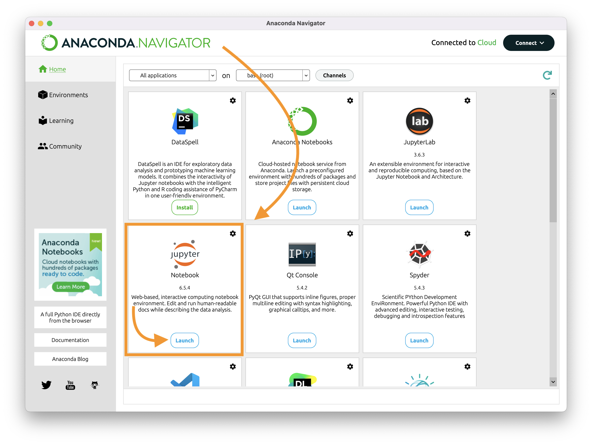
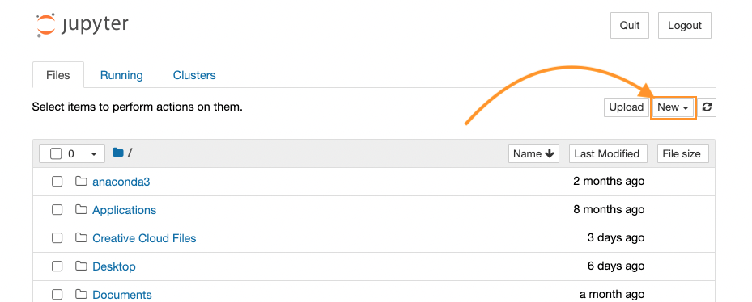
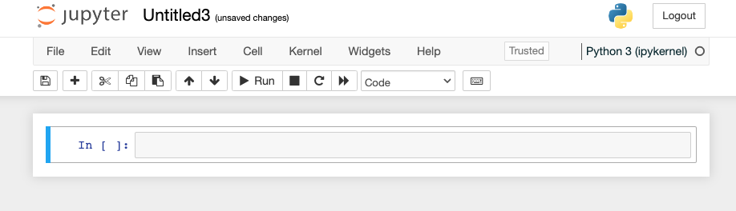
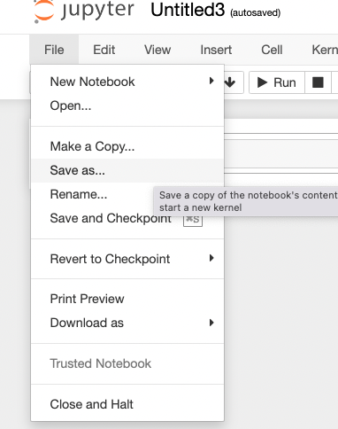

# Week 4: Critical code studies
September 11, 2023

## Plan for the day:

* [First half](#first-half): Discussion
    - Warm-up writing
    - Tensions, takeaways, confusions, questions
    - Grok writing (around 10:15)
* Break (10 min)
* [Second half](#second-half): Python rising
* [Homework for next time](#hw): About those presentations

## First half: Tensions, takeaways, confusions, questions

### Warm-up writing
I'd like you to start by calling to mind the conversations you had (with the authors; with each other) in the forum or in the margins of the readings for this week. What stands out to you as a particularly important **take-away**, something memorable or surprising? What stands out as an **unresolved** point of tension or confusion?

Depending on your own practices, you may want to make lists or freewrite, or even draw a picture or diagram. Either way, I want to spend 5 minutes on this composing-to-center.

### Let's talk!

If we get to grok-writing by around 10:15, that should give us about equal time to play with the concepts now and to play with the methods in the second half.

Let's take notes at [bit.ly/dsam2023fall-notes](https://bit.ly/dsam2023fall-notes#heading=h.n81zs691u1cv)

All three posts this week were on Ruha Benjamin's <em>Race after Technology</em>! Happy to talk about that.

(That said, as we're talking, let's see if we can also find opportunities to fold in the example of 10 PRINT, the idea of computational literacy as infrastructural, or the poetics of code.)

As needed, some passages/questions from the forum:

"Move Slower": naivety and the illusion of neutrality

    
On page 35 of <em>Race After Technology</em>, Ruha Benjamin approvingly quotes danah boyd and M. C. Elish, who write that "[t]he datasets and models used in these systems are not objective representations of reality. They are the culmination of particular tools, people, and power structures that foreground one way of seeing or judging over another." What systems? It almost doesn't matter – it would still be true – but Benjamin puts it in the context of algorithmic problem solving, whether that means a manually calculated formula (as with the so-called "three-fifths compromise," an example Benjamin borrows from Yeshimabeit Milner) or the complex computer algorithms that govern search and suggestion engines.

    
Immediately after the line above (which Khushboo also cited approvingly), Benjamin writes:
 <blockquote>
By pulling back the curtain and drawing attention to forms of coded inequity, not only do we become more aware of the social dimensions of technology but we can work together against the emergence of a digital caste system that relies on our naivety when it comes to the neutrality of technology. (35)
</blockquote>
    
It's worth pausing there, I think! She continues:
 <blockquote>
This problem extends beyond obvious forms of criminalization and surveillance. It includes an elaborate social and technical apparatus that governs all areas of life.

The animating force of the New Jim Code is that tech designers encode judgments into technical systems but claim that the racist results of their designs are entirely exterior to the encoding process. Racism thus becomes doubled – magnified and buried under layers of digital denial. (35–36)
</blockquote>

<!--/Move Slower-->

"Tailoring: Targeting": being consumed by passive consumption

    
Sidra raised some valuable questions about "our own general passivity in regard to our information being used without our permission" – or, when we do give <em>some</em> permission (for instance, as a condition of using Gmail or Netflix etc), being used in ways we don't expect and/or find creepy. 

    
To quote Ruha Benjamin again:

    <blockquote>Importantly, Netflix and other platforms that thrive on tailored marketing do not need to ask viewers about their race, because they use prior viewing and search histories as proxies that help them predict who will be attracted to differently cast movie posters. (47)</blockquote>
    

Or again:

        <blockquote>
            
Niche marketing, in other words, has a serious downside when tailoring morphs into targeting and stereotypical containment. Despite decades of scholarship on the social fabrication of group identity, tech developers, like their marketing counterparts, are encoding race, ethnicity, and gender as immutable characteristics that can be measured, bought, and sold. [...]

            
Consider this ad for ethnicity recognition software developed by a Russian company, NTech Lab – which beats Google's Facenet as the world's best stystem for recognition, with 73.3 percent accuracy on 1 million faces. NTech explains that its algorithm has 'practical applications in retail healthcare, entertainment and other industries by delivering accurate and timely demographic data to enhance the quality of service'; this includes targeted marketing campaigns and more.

            
What N-Tech does not mention is that this technology is especially useful to law enforcement and immigration officials and can even be used at mass sporting and cultural events to monitor streaming video feed. This shows how multicultural representation, marketed as an individualistic and fun experience, can quickly turn into criminalizing misrepresentation. (51–52)

        </blockquote>
    
<!--/second quote -->

<!--/Tailoring: Targeting-->

"Raising Robots": individual agency vs structural bias

    
Alex went a little beyond the assigned section in <em>Race after Technology</em>, but it's worth looking at. This section starts on page 133:

    <blockquote>
        
Too often people assume that racism and other forms of bias must be triggered by an <em>explicit</em> intent to harm; for example, linguist John McWhorter argued in <em>Time</em> magazine that "[m]achines cannot, themselves, be racists. Even equipped with artificial intelligence, they have neither brains nor intention." But this assumes that self-conscious intention is what makes something racist. Those working in the belly of the tech industry know that this conflation will not hold up to public scrutiny. [...]

        
Robots are not sentient beings, sure, but racism flourishes well beyond hate-filled hearts. An indifferent insurance adjuster who uses the even more disinterested metric of a credit score to make a seeminly detached calculation may perpetuate historical forms of racism by pluggin number sin, recording risk scores, and "just doing her job." Thinking with Baldwin, someone who insists on his own racial innocence despite all evidence to the contrary "turns himself into a monster." No malice needed, no N-word required, just lack of concern for how the past shapes the present – and, in this case, the US government's explicit intention to concentrate wealth in the hands of White Americans, in the form of housing and economic policies. Detachment in the face of this history ensures its ongoing codification. (Benjamin 133–135)

    </blockquote>
    
And I can't help quoting this formulation, a few pages later:

    <blockquote>
        
There is no need to identify "giggling programmers" [here she's quoting McWhorter again] self-consciously seeking to denigrate one particular group as evidence of discriminatory design. Instead, so much of what is routine, reasonable, intuitive, and codified reproduces unjust social arrangements, without ever burning a cross to shine light on the problem. (138)

    </blockquote>

<!--Raising Robots-->

### Grok writing

    
Spend some time putting marks on a page to help you think through, and consolidate for yourself, what we discussed today. What do you want to remember? What are you left wondering?

After a few minutes, I'll ask everyone to share one thing, to which the only response will be "thank you."

<a href="week-03#an-explanation" class="smaller" title="We skipped this explanation in week 3, but it's there if you're curious">Why this terminology?</a>

## Break (10 minutes)
Assuming we left off at 10:30, let's aim to start up again at 10:40 or so. That should beat the elevator rush for 11am classes.

### While you're out... install anaconda?
I forgot to ask you to do this as part of the homework last week, but hopefully you saw my email. My apologies! If you don't yet have this installed, maybe set it up to start downloading and unpacking while you're chatting, snacking, bathroom breaking, etc: [anaconda.com/download](http://anaconda.com/download), and choose the non-cloud installation; when prompted, use the options for "Just Me" and (if you're on Mac or Linux) to add Anaconda to your PATH environment variable.

## Second half: Python rising

### Orienting
As a preamble-slash-reminder, I'm not asking you to learn Python because it's the only language you'll ever need, or because it's impossible to do good work in digital studies or using digital methods without programming. Even so, I am asking you to *engage with code* because code underlies all digital methods, and it will help you think about code's affordances to get more familiar with how it works; and I'm asking you to practice with Python in part because there are, indeed, a ton of Digital Humanities projects out there that are written in Python, and it's a pretty flexible language that I hope will serve you well.

But also, you'll note that last week we were working in JavaScript, and part of the homework reading involved code in BASIC. **What I *most* want you to take away aren't the specifics of any one programming language, but rather the patterns that cross languages: things like functions, conditionals, and loops.**

To help you get a little deeper into those patterns, today I'm asking you to read through Montfort's fourth and fifth chapters, doing the exercises in real time while we're around the table to help each other.

<!-- To make that even more explicit: **you do not have to do these exercises alone.** It often helps to puzzle through things together, especially when they're new. That applies moving forward, too, for hands-on exercises outside of class, as well as for projects. Collaboration is welcome here. -->

* Chapter 4, "Calculating and Using Jupyter Notebook," is mostly intended to get you used to writing small snippets of Python code in the Jupyter Notebook interactive interface. While most of the examples are simple math, the bigger lessons here are to see how *error reporting* works in your favor, and to draw a useful distinction between **valid** programs (i.e. syntactically correct, compiling) and **intentional** programs (i.e. programs that do what you want).
    - Toward the end of the chapter, there's a somewhat interesting digression on the history of HTML and why you can write invalid HTML and it'll still load in your browser. By all means read it if the first part goes quickly! But if you need to skip this to get to the more exciting stuff in chapter 5, go ahead and save section 4.5 for another day.

* Chapter 5, "Double, Double," is the more substantive chapter of this pair. It asks you to study a function, make some predictions about how it works, and then change it: to explore the code as we did with the poetry generators last week.

### Logistics

As you're working, **save your progress** with a meaningful filename. I think the easiest thing to do for now is just to save a file for chapter 4 and a file for chapter 5 **into the same repository we used last week.** That way, you can *commit the official versions* and then see the diffs once you make changes and commit again. (I had called that repo "dsam-montfort-03," but I've since thought better of that and [renamed](https://docs.github.com/en/repositories/creating-and-managing-repositories/renaming-a-repository) the repo "dsam-montfort" to signal that we can use it for all our work with the book. You live, you learn! All your existing forks and links should continue to work.)

To use Jupyter Notebook...

1. Run the Anaconda Navigator app
2. In the list of programs that appears, find Jupyter Notebook and click "Launch."
3. You may see a command line pop up and run some things; be patient. Eventually you'll get a browser window pointed to localhost:8888/tree. Go ahead and navigate to your DSAM folder, or (even better) your dsam-montfort-03 folder.
4. To start a new file, look for the "New" button above the table of files. Click on it and select Python 3 (ipykernel).

Show me

<figure>
    
    <figcaption>Don't be fooled by JupyterLab or Anaconda Notebooks; the one we want is Jupyter Notebook.</figcaption>
</figure>
<figure>
    
    <figcaption>Notice the similarity to the GitHub interface? (We could use that high-contrast color to highlight the New file button, but alas.)</figcaption>
</figure>
<figure>
    
    <figcaption>When you see a cell inviting you "In [ ]:" you've made it.</figcaption>
</figure>
<figure>
    
    <figcaption>When you're ready to save, the File menu gives you the Save As option.</figcaption>
</figure>

### Go forth!

Follow along with <a class="alert-link" href="https://mitpress.ublish.com/ebook/epah2e-preview/12629/39">the chapter</a>. Each time you come to a bit of code in the book, enter it in your own Jupyter Notebook and press Shift-Enter to run it.

I'll circulate, but call me over as needed.

And don't forget to save and commit (with a meaningful message) when you reach a significant checkpoint!

## Homework for next time

    Reminder: <strong>no class next week</strong>, because of Yom Kippur. We'll meet again on Monday, October 2nd.

* No new readings!
* If you didn't finish these two chapters during class, catch up on your own time.
* Other than that, **these two weeks are all about your independent projects.**
    - Continue working to assemble and process your source material
    - Continue logging your time in a [Mindful Practice Journal](../projects#mindful-practice-journal)
    - Post some [public-facing representation of your project](../projects#palimpsest-of-public-iteration)
    - Prepare a [presentation](../projects#presentations-and-peer-review) for the rest of your classmates, including a 5-minute pre-recorded portion.
* I won't require you to come to office hours next week, like I did in week 2, but you are certainly welcome to [sign up](../office) if you'd like! Or email me if that's easiest.

### About those presentations

* _What should they include?_
    - Give us a brief **overview of the project as a whole**. What are you trying to do?
    - Give us a brief **update on the project's current status**, including a tour of the most recent public-facing version of your project.
        * Depending on your project, this might be a GitHub repository with some files in it and a README; it might be a searchable Google spreadsheet; it might be a Scalar site with just a handful of objects; it might be a series of scanned sketches and a timeline for how you'll move forward. Just get something started, so you can see how much it's changed by the end of the course.
    - Give us a brief **process reflection**: what's working well so far? What are you excited about? What are you wondering?

* _Did you say "pre-recorded"?_
    - This is a bit of an experiment, but yes: I'm asking you to record yourself giving a short timed talk.
    - There are multiple reasons to do this: it builds a record for people who may have to be absent; it encourages you to practice your talk and decide what's most essential; and that, in turn, makes it more likely that we'll have enough time for everyone's presentation in the first half of class, so we can start writing comments to peers in the second half.

* _What should we be recording, exactly?_
    - While I won't require that you prepare slides, some visuals are probably going to be helpful, and more so as the semester goes on and the public face of your project develops further. What do your source materials look like? How are you processing them, or trying to? How are you presenting them to readers (for now, us)? In addition to the sources, seeing the interfaces of your digital tools will help us all think about the affordances of those tools.
    - After we've seen everyone's presentations, we can talk about what we valued as audience members, and what we might want to try, method-wise, in terms of future presentations.

* _How do we make these recordings?_
    - I don't have a preference for what tech to use for your recording, but one option you should know about is Panopto screen capture; you should have access through my.pitt.edu. Alternatives include Vimeo Record, Screencast-O-Matic, and any number of options you can find in online roundups and reviews; and you can also record a Zoom even if you're the only one in the room, which should allow you to both share your screen and add a picture-in-picture of your face.

* _UPDATE: Where and how should we post?_
    - When your video is ready, head over to the [discussion forum]({{site.repo_url}}/discussions), where I've added a forum for posting your videos and links to the current iterations of your [public-facing palimpsests](https://benmiller314.github.io/dsam2023fall/projects#palimpsest-of-public-iteration).
    - Adding a video is as easy as dragging a local file into the editing box for your post!

Any other questions or suggestions?

Have a great couple of weeks, everyone, and please do be in touch in the meantime if I can be of any help!
