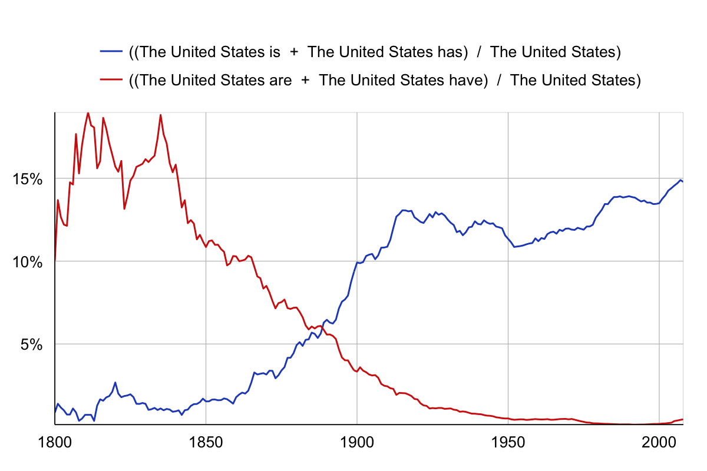

# Week 9: Data 3: Analysis and visualization
October 23, 2023

## Plan for the day:

* [First half](#first-half): Let's discuss!
    - Warm-up writing
    - Terms, tensions, takeaways, confusions, questions, connections
    - Grok writing (around 10:30)
* Break (10 min)
* [Second half](#second-half): Let's practice!
    - Studio time
        * Set goals
        * Work toward them
        * Exit note
    - EXT: Troubleshooting projects, together
    - ALT: Spreadsheets & datavis
* [Homework for next time](#hw): second iteration

## First half: Discussion

### Warm-up writing

In a [syllabus](https://scottbot.github.io/IntroDH2020/overview/) for "Introduction to Digital Humanities," [Scott Weingart](https://scottbot.github.io/ "not long ago, a DH specialist with the CMU libraries; currently directing the NEH Office of Data and Evaluation") proposed that rather than define the term in the title ("too much baggage"), his goal was to pursue understanding of a single chart:

<figure>
    
</figure>

Take a minute to look at the graph and think about it. **What do you notice? What do you wonder?**

### Let's talk!

If we get to grok-writing by around 10:15, that should give us about equal time to dig into ideas now and then to dig into process in the second half.

And maybe we can take some collaborative notes at [bit.ly/dsam2023fall-notes](https://bit.ly/dsam2023fall-notes)?

Some possible moments to revisit, as needed:

<ol class="spaced">
    <li>

We might look at some figures:

        <ul>
        <li><a href="https://ebookcentral.proquest.com/lib/pitt-ebooks/reader.action?docID=6120950&ppg=162">Changing titles</a> on the same graph of racial disparities in rates of mental health diagnosis (Klein and D'Ignazio, figures 6.6 and 6.7)</li>
        <li>Scale of <a href="https://learning.oreilly.com/library/view/the-truthful-art/9780133440492/ch05.html#:-:text=Figure%205.5%20Scale,most%20graphs.%E2%80%9D2">"elementary perceptual tasks"</a> (Cairo, figure 5.5)</li>
        <li><a href="https://learning.oreilly.com/library/view/the-truthful-art/9780133440492/ch05.html#:-:text=For%20instance%2C%20think,Figure%205.7%20displays.">European asylum seeker application decisions</a> (Cairo, figure 5.7)</li>
        </ul>

    </li>
    <li>

Alex <a href="https://github.com/benmiller314/dsam2023fall/discussions/11#discussioncomment-7348276">asked</a> about consent:
 <blockquote>I’m also interested in talking about consent from online users (say you’re collecting Reddit or Instagram comments, which some of my students are interested in doing). I still feel wary in some ways about scraping comment sections to use for their work even though the posters published them on public forums. Is this enough consent? This I think is very subjective and the context has to be considered, but I still wonder to what extent I can help translate their desires to work with certain online communities to the feminist methodological framework that D’Ignazio and Klein put forth.</blockquote>
One possible strand to pluck at. These forum posts I'm pulling from here: how would you feel if someone quoted them in a study of the uptake of digital studies course content? how would you feel if they weren't quoted, but only summarized as part of a statistic?

</li>
    <li>

Khushboo <a href="https://github.com/benmiller314/dsam2023fall/discussions/11#discussioncomment-7348884">pointed</a> to a tension between scale and representation:
<blockquote>Given the nature of my project, it is difficult to reduce the afflicted population into numbers and most Palestinians have repeatedly expressed their disdain towards such an approach. While I second Arnold and Tilton’s claim that using a “general purpose statistical programming language increases the available set of methodological approaches to studying humanities data,” I also acknowledge the reluctance of my subjects for whom the idea of being translated into numbers or statistics runs contrary to apt representation. This leads me to ponder upon what other universally accessible and acceptable approaches would befit such situations. If one needs to find right visualizations, they need to start asking right questions.</blockquote>
One visualization mode we'd been talking about is a map; another is a timeline. What do these tools <em>afford</em> differently from text or quantitative charts?

</li>
    <li>

Sidra <a href="https://github.com/benmiller314/dsam2023fall/discussions/11#discussioncomment-7352157">sensed</a> a connection...
... between "our larger discussions of misrepresentation and context" and "<a href="https://www.cnn.com/2023/10/07/us/girl-math-boy-social-media-cec/index.html">girl math</a>'s rise and fall on the internet's established timeline of innocent joke distorted and hijacked to be used for bigotry and violence." Can we lean into that <a href="https://compcomm.commons.gc.cuny.edu/feltsense/part-one-what-is-felt-sense/">felt sense</a>?
</li>
    <li>

We could talk through some key terms, for those who missed them in our warmup today:

        <ul>
        <li>"big dick data"</li>
        <li>open data</li>
        <li>"zombie data"</li>
        <li>"raw" data</li>
        <li>API</li>
        <li>knowledge infrastructure</li>
        </ul>

    </li>
    <li>

Finally, because we're back to presentations next week, we can talk about rhetorical strategies for presentations:
 What did you value in the way your classmates organized their time or directed your attention? One way of starting to get at that is to ask, <em>what do you remember from last time?</em> To PowerPoint or not to PowerPoint? To screencast or screenshot?
</li>
</ol>

### Grok writing

    
Spend some time putting marks on a page to help you think through, and consolidate for yourself, what we discussed today. What do you want to remember? What are you left wondering?

After a few minutes, I'll ask everyone to share one thing, to which we'll all say, simply, "thank you."

<a href="week-03#an-explanation" class="smaller" title="We skipped this explanation in week 3, but it's there if you're curious">Why this terminology?</a>

## Break (10 minutes)
Assuming we left off at 10:30, let's aim to start up again at 10:40 or so. That should beat the elevator rush for 11am classes.

## Second half: Hands on

With the second public iteration of your projects coming due next week (online and in class presentations), I expect most people will want to focus on their projects, and I'm happy to dedicate the time to studio.

If you want an alternative to your project, may I recommend again looking for relevant tips on [the InfoEco cookbook](https://infoeco.hcommons.org/infoecocookbook/cookbook-modules/)? If you'd rather keep it relevant to this week's theme of graphs and data, for instance, the squirrel video came with [several excellent guided exercises](https://infoeco.hcommons.org/infoecocookbook/cookbook-modules/pivot-tables/).

When it comes time to visualize, I've been enjoying [DataWrapper](https://datawrapper.de), which employs a <dfn><abbr title="graphical user interface">GUI</abbr></dfn> to enable fast switching among a wide array visualization modes (gotta love that grammar of graphics) and has a great many shapefiles for mapping already built in (or you can upload your own, because it does not include all regions, or in the combinations you might need). The forms thoughtfully include prompts for naming and linking to your data sources and for adding notes (e.g. on what's included, and what isn't, and what your units mean). The site also includes a ton of [good advice on designing for communication with data](https://academy.datawrapper.de/), alongside tutorials with sample datasets provided.

### Reflective writing / Goal setting
Before we all split off, though, take a moment to check in with yourself: do some private writing in response to these questions.

1. What keeps you coming back to your project? What makes it important, or exciting, for you to work on now?

2. Think about the state of your project as it stands now, and where you'd like to be by next class. Try to make **a list of the parts, steps, or or pieces** you want to accomplish. Try to be specific. e.g. Rather than "find sources," you might say, "search MediaCloud for news stories"; rather than "work on analysis," you might say, "take facet counts from OpenRefine and make a series of bar charts"; etc.

3. Look over your list, and **choose one thing you'd like to accomplish – or ask about – in class**. If you can't pick just one, choose a top three... and then pick one to start with.

When you have a sense of your studio goals, please write them into the shared google doc: <a href="https://bit.ly/dsam2023fall">https://bit.ly/dsam2023fall</a>

## Go to!
Get started, and call me over as needed!

 Don't forget to save and commit (if you're using GitHub) and to log your time in your Mindful Practice Journal.

## Exit note
When the end of the class is approaching, **please head back into the google doc** and respond to your own note from earlier:
* How far did you get?
* What are your new priorities for the coming week?

## Homework for Next Time

Final reminder of the upcoming DSAM-relevant event! Not required, but highly recommended:

* Antonio Byrd, "[Coding Black Functions for White Software Programs](https://calendar.pitt.edu/event/dr_antonio_byrd_coding_black_functions_for_white_software_programs)," Thursday, October 26, 5:00-6:30pm, 501CL. Dr. Byrd's talk is super-relevant to our topics for the last couple of weeks: he'll be presenting findings from focus-group interviews and participant-observation in a coding "bootcamp," noting the ways that the curricula and assessment practices largely center white end-users, and proposing an alternative vision. This is part of his book-in-progress called _The Literacy Pivot: How Black Adults Learn Computer Programming in a Racist World_.

There is **no new required reading this week** so you can focus on your independent projects.

Because this is the second iteration, and we all know the basics already, this time through try to focus on...

<ol><li>the questions you're asking or problems you're addressing</li>
<li>the answers or solutions you have so far, however partial they may be</li>
<li>how you know</li>
</ol>

More generally,
- continue working to assemble and process your source material
- continue logging your time in a [Mindful Practice Journal](../projects#mindful-practice-journal)
- _update_ your [public-facing representation of your project](../projects#palimpsest-of-public-iteration). If you need to keep it private for reasons we've discussed, please talk to me about granting access to me and your classmates
- prepare a [presentation](../projects#presentations-and-peer-review) for the rest of your classmates, including a 5-minute pre-recorded portion

Post <strong>your recording</strong> and a <strong>link to your live project</strong> to the <a href="{{site.repo_url}}/discussions">discussion forum</a> in advance of next Monday's class.

I won't require you to come to office hours, but you are certainly welcome to [sign up](../office) if you'd like! Or email me if that's easiest.
