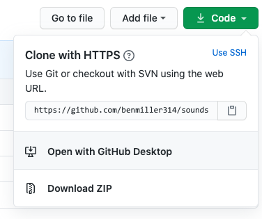
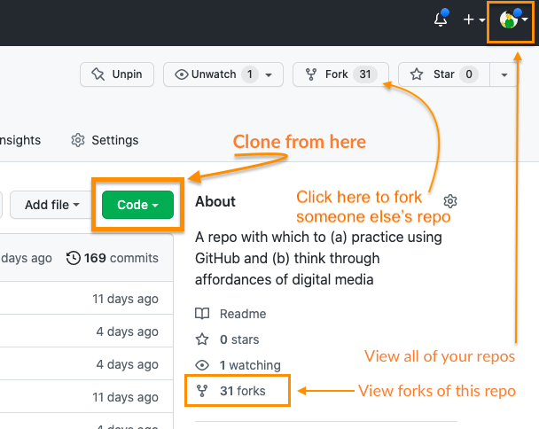

# Lesson 1: Digital Affordances
August 28, 2023

**Texts to have read:** the course description, Ben's email from last week

**Writing to turn in:**

* (at end of class) survey about your work environment, etc + a letter to Ben in response to his

## Plan for the day:

* [First half](#first-half): Getting to know each other (90 min)
    - Entering the room (preliminary announcements; first-day info sheet; private writing to seed discussion) (~10 min)
    - Discussion: What are we studying in "digital studies"? (~50 min) <!-- key terms: affordance, procedural, participatory, encyclopedic, spatial -->
    - Letter from Ben (~10 min) <!-- play 5 min of Posner *during* the letter?? -->
    - Letter to Ben (~20 min)
* Break (10 min)
* [Second half](#second-half): Getting to know GitHub (70 min)
    - Why do versions need controlling? (~5 min)
    - Text demo (~10-15 min) <!-- key terms: repository, commit, fork, clone -->
    - Your turn (~20-25 min)
    - Update letter to Ben (~10 min)
* HW for next time (~10 min)

## Entering the room

### As you're settling in:

* I invite you to make yourself a little name-plate on a tri-folded piece of paper – or adjust the way your name displays in Zoom. For example, I want you to know that you can call me Ben, and that I use he/him pronouns. How would you like us to address you?

* For a little more getting to know you, please fill out [this first day info sheet](https://forms.gle/Nqc7KLeP5CMBVhBi8) via Google Forms. If you can't get to it now, then at your earliest convenience. And if you have a device but not this page, you can get here by loading [https://benmiller314.github.io/dsam2024fall](https://benmiller314.github.io/dsam2024fall), clicking Schedule, and scrolling down to click on Week 1. (Or use the "current lesson" shortcut link at the top.)

* Last pre-class note: I want this class to welcome everyone. While I have not received word from anyone about challenges to hearing or vision, that doesn't mean the challenges don't exist. If you would prefer that I speak up, slow down, or zoom in, or if there's any other class feature that's impeding your success, please do let me know!

### We begin with writing

With those preliminaries out of the way, let's begin with some writing! I won't collect what you're about to write, but I will ask you to share something from it, out loud, a little later today. Take about 5-6 minutes on these two tasks together:

<ol class="spaced">
    <li>List your associations with the word <em>digital</em>. When you hear it, what (else) do you think of? What does that make you wonder?</li>
    <li>Think about an area of research, teaching, or practice you know well (or have been recently engaged with) in which the word <em>studies</em> is used in a compound phrase. For me, for example, that might mean "Composition Studies" or "Writing Studies" as opposed to "Composition" or "Writing." Within your chosen area, <em>what do you see changing when you add or take away the "studies" part?</em></li>
</ol>

EXT: What makes something digital different from something non-digital? What can digital things _do_ (or not do), or what can we do with them?

NB: I often use that EXT notation to signal an "extension activity," i.e. something you can do if you finish before the rest of the class, or if you just want to dig a little deeper. (There is always more to do.) In this grad class, I'll also use it to for optional readings that provide more depth or background than we'll have time to get into together, but which might be helpful for some of you on particular subjects.)

## Discussion: What are we studying in "digital studies"?

### Part 1: Studies

Let's talk! Please tell us (1) your name, (2) your preferred pronouns if you'd like, and then (3) your brief answer to the second of the seed prompts above: What's an area or field you're familiar with that uses "studies" in its name, and what does it mean to add that term or take it away?

Oh, also! Should we want to take notes, we have a shared google doc just for that purpose, which you can access and edit at **[bit.ly/dsam2024fall-notes](https://bit.ly/dsam2024fall-notes)**.

<aside class="alert alert-info">
NB: When taking collaborative notes, I recommend always leaving at least one blank line underneath where you're typing; it lets others jump in. (So when you do jump in, start by adding at least one blank line underneath where you're typing, to let others do the same.)
</aside>

### Part 2: Digital

Janet H. Murray, author of _Hamlet on the Holodeck_ and _Inventing the Medium_, posits that there are four main "[affordances](https://en.wikipedia.org/wiki/Affordance)," or salient enactable properties, of digital media. As [she summarizes her argument](https://inventingthemedium.com/four-affordances/),

> Everything made of electronic bits is potentially:
>
> * procedural (composed of executable rules)
> * participatory (inviting human action and manipulation of the represented world)
> * encyclopedic (containing very high capacity of information in multiple media formats)
> * spatial (navigable as an information repository and/or a virtual place)

(To read more, see Murray, Janet H. “Affordances of the Digital Medium.” _Inventing the Medium: Principles of Interaction Design as a Cultural Practice_, The MIT Press, 2011, pp. 51–85. Pitt libraries [has a digital copy](https://ebookcentral.proquest.com/lib/pitt-ebooks/reader.action?docID=3339350&ppg=66).)

When you look back at your notes from the start of class, how well do Murray's descriptions line up? What do these affordances help you see about the digital examples you'd chosen... or vice versa?

Again, let's try to use the [shared notes doc](https://bit.ly/dsam2024fall-notes) if possible.

EXT: another framework

Lev Manovich, in <em>The Language of New Media</em>, proposes five "principles of new media," or essential features that shape how digital media behave:

<ul>
    <li>numerical representation: new media objects can be described or manipulated mathematically</li>
    <li>modularity: new media objects are composed of independent elements that can separated or acted on independently</li>
    <li>automation: actions on new media objects can be performed by other new media objects, seemingly without direct human action, allowing humans to "collaborate with the machine"</li>
    <li>variability: new media objects have no fixed form, but maintain their identity through changing representations</li>
    <li>transcoding: we understand culture through the lens of computers, and computers through the lens of culture</li>
</ul>

Where do these new terms map neatly onto Murray's, and where do they highlight something else? What affordances follow from these principle features? What questions do they raise?

NB: My preferred way to read more about this hasn't actually been Manovich's book, but rather a webtext by Madeline Sorapure, “Five Priniciples of New Media: Or, Playing Lev Manovich.” <em>Kairos: A Journal of Rhetoric, Technology, and Pedagogy</em>, vol. 8, no. 2, <a href="http://kairos.technorhetoric.net/8.2/coverweb/sorapure/">http://kairos.technorhetoric.net/8.2/coverweb/sorapure/</a>. Unfortunately, that article was built using the now-deprecated Adobe Flash, so it no longer displays the interactive features that illustrated each of the principles. (You can still read a PDF description of what used to be there.) On the plus side, Sorapure's examples were actually created by her students, so if anyone is looking for an independent project, you could do worse than creating a new set of illustrative examples for Manovich's principles (or Murray's, for that matter)!

## 2. A letter from Ben
You can download it from the website in [.docx](/{{site.course.base_path}}uploads/letter-from-ben.docx) or [.md](/{{site.course.base_path}}uploads/letter-from-ben.md) format if you'd like to follow along.

## 3. A letter back to Ben.
I'll try to leave a little time at the end of class to add on, too, but let's take until about 10:30 to start an informal response.

Please do this **on the last page of that same survey from the start of class**, which you should still have open. If you've misread the instructions and already turned it in, email's a good fallback option: I'm at millerb@pitt.edu.

Some considerations you might address include:

* What were your expectations for the course coming in? What were your goals? If they’ve changed at all after the first half of class, how?
* What, if anything, surprised you in my letter? Why? If you have any questions or concerns, please ask them!
* If anything in my letter particularly excites you, or helps you, please let me know that, too!
* What assets or experiences do you bring to the class that might help you or your classmates? What challenges do you think you’ll face?

Don’t feel that you have to answer every single one of these questions, and especially don’t feel you have to answer them in order. Similarly, don’t feel your letter must be limited to only those questions covered in the bullet points.

* EXT: If you finish early, think about making the letter multimodal. e.g. What images or sounds would you want to add? How might you arrange the images and text?
* EXT: If you finish that, too, consider audience: how might you want to change this letter for posting an introduction to yourself on the course's (public) website, vs. just sending to me?
* EXT: Finally, if you've considered those and still feel pretty satisfied, feel free to start your break!

## Break (10 min)
Assuming we left off at 10:30, let's aim to start up again at 10:40 or so. That should beat the elevator rush for 11am classes.

## Second half: Getting to know GitHub

Maybe this will seem familiar:

<figure role="figure">
  
  <figcaption>from <a href="http://phdcomics.com/comics/archive.php?comicid=1531">PhD Comics</a> by Jorge Cham (2012).</figcaption>
</figure>

Retaining and renaming ever more files eats up your storage space, sets you up for disappointment if you use "final" labels, and – if you ever need to recover some old version, which is presumably why you were bothering to keep these all around in the first place - doesn't make it any easier to keep track of what you've got.

There is a better way!

The *git* version control system instead allows you to **track the differences** between versions of files **while keeping the same filenames.**

*[GitHub](https://github.com)* is a cloud-based system for sharing files and histories with other people. If you spend a while working with digital methods, chances are you're eventually going to be directed to GitHub to download some code or data. But as we'll see, there are reasons to put the power of GitHub to work for you, too, that are independent of programming.

### Text demo

Let's check out the GitHub.com web interface, and see how it works:
<strong><a href="https://github.com/benmiller314/text-demo">https://github.com/benmiller314/text-demo</a></strong>

Initial questions to ask of any app:

- How is the space laid out?
- What's given the most prominent visual focus? Secondary focus?
- What features/tools do you have quick access to?

In other words: what functions or actions are _afforded_ by this interface?

Once we've set some expectations, let's see what we can do.

Here's my plan, and for now, I'll drive. (You'll have your turn later.)
<ol>
    <li>Tour the file system, including how to navigate and where the history lives.</li>
    <li>Edit our text file, and let's have fun with it.</li>
    <li><strong>Commit</strong> the edited file directly to master.<ul>
        <li>Note that the commit message has two parts: a short label, and a bigger box. These are kind of like the subject line of an email and the email body. The first is what you'll see automatically when browsing the history; the second will require an additional click. GitHub will let you leave the "body" blank, but you're required to have a "subject line."</li>
        <li>Note as well that <em>the default commit messages are pretty meaningless</em>. We can do better! Let's always try to say *how* a file is changing, or what we're trying to accomplish by changing it, rather than just saying that it's changed.</li>
        </ul>
    </li>
    <li>Let's get some more changes! After the second or third, I want us to create a new <strong>branch</strong> and <strong>pull request</strong> instead of committing.<ul>
        <li>Why, you ask? It matters when you're working with others: you want to make sure you're comparing against the most up-to-date version, so you don't accidentally erase something new.</li>
        </ul>
    </li>
</ol>

### Your turn! Download what you'll need

To work directly on the GitHub website, you don't need anything but a web browser. But most of the time, you're going to want to have a *local copy* of your project that you can *pull* down from the clouds, make your changes on your own machine, and then *push* back up with the changes and history intact.

In git-speak, that linked local copy is called a *clone*. There are some good [instructions (including pictures) in the GitHub documentation](https://help.github.com/articles/cloning-a-repository) for how to make a clone. But probably the easiest way to is to work with an app like [GitHub Desktop](https://desktop.github.com/).
<!--
I've got another repo for you to [Digital Affordances repo](https://github.com/benmiller314/dsam-digital-affordances). -->

To make a clone from a repo on the GitHub website, first click the green code button:

<figure>
    
    <figcaption>Clicking "Open with GitHub Desktop" will guide you to the download page if you don't already have it.</figcaption>
</figure>

Note that there is a "Download ZIP" option: that would let you get the _current_ version of the files. But it wouldn't let you contribute back to the repo. Plus, if you clone, _you get the whole revision history_. Double win!

<!--
5. Use the CODE button to *Open in GitHub Desktop*. Ask the questions above again: how is the space laid out? What's given the most prominent visual focus? Secondary focus? What features/tools do you have quick access to?
-->

Select "Open with GitHub Desktop" and follow the link to download the app if you haven't yet.

Once you get the file open, let's again ask our questions:

- How is the space laid out?
- What's given the most prominent visual focus? Secondary focus?
- What features/tools do you have quick access to?

In other words: what functions or actions are _afforded_ by this interface?

### Various views of the same files

When you clone a repository, it shows up on your computer as a folder, because *that's all a repository is: it's a file folder.* You can open it in Finder (Mac) or Explorer (Windows), and everything's arranged just the way you'd expect.

In fact, you'll need to tell GH Desktop where you want this repo to live within your file system – and if you're getting an error that the "folder is not empty," you just need to give it a new name to create the repo as a subfolder.

Help with "folder is not empty" error

<figure>

</figure>

Note that you can also open the repository (folder, directory – they're all the same thing, essentially) via [command line](https://developer.mozilla.org/en-US/docs/Learn/Tools_and_testing/Understanding_client-side_tools/Command_line) (a.k.a. _Terminal_ on Mac, or _GitBash_ or _PowerShell_ on Windows), and the files will be the same. They're all just different vantage points on the same location.

**GH Desktop, though, will only show you the files that have changed.** If you're looking at a blank window and you're worried that no files are showing, all it means is that everything's in sync with the latest commit. In that case, though, GH Desktop kindly offers to open the file in your usual file system – or in an external text editor. Let's do that!

<figure>
    
</figure>

VS Code or Pulsar will work equivalently here, as will most other plaintext editors. MS Word will not, though as an EXT you're welcome to try and see what happens!

    
Working on your own or in pairs, edit the poem on your own device and save the file.

    
Then head back into GH Desktop. What do you see? What features/tools do you have quick access to now (e.g. if you right-click)?

### Push and pull (and fork)

Saving changes to your file is only the first step to changing your repository. For now, git knows the file has changed, but it's not sure if you're ready to take the next step – to commit.

Note that this is one key difference between editing directly on the GitHub website and editing locally: on the website, you have to commit to save. On your own machine, you can instead wait until several files are ready before bundling all those changes into a single commit. Even then, you can also choose to include just *some* of your changes in the commit. Working on your own machine gives you that flexibility.

And there's still one more step before everyone else can see even your most committed changes: you still have to **push** your changes.

If you try to do that with this repo, you'll notice a problem: I didn't give you edit access.

What does GH Desktop do to help you solve this problem?

Where a <em>clone</em> is a kind of one-to-one shadow of a remote repository (or vice versa), a <strong>fork</strong> is like an alternate reality: a new copy that lives (more or less) independently from the first one. (Any <a title="Fork had a different association for me in high school, but it turns out to have a pretty similar effect." href="https://gatherer.wizards.com/Pages/Card/Details.aspx?printed=false&multiverseid=202493">Magic: The Gathering</a> fans in the room?) You can still merge across forks, and in fact this is the reason that a pull request is called a pull <em>request</em>: you have to get permission from the owner of the original repo before merging in.

You can also fork directly from the GitHub website: just look for the button along the top of the repo's root page.

    

Show me

    <figure>
        
    </figure>
    

<!-- Remember that all these error messages and cross-links (e.g. to preferences) had to be set by human programmers. Figuring out what behaviors to anticipate, and how to gently steer people in the right direction, is the field of User Experience Design, or UX. -->

### Update letter to Ben (if you want)

If time and interest encourage you to do so, feel free to add to the end of your letter to me. Otherwise, go ahead and submit the survey / send the email before you leave!

## Homework

### For next time
There's no class next Monday, so I'm asking everyone to instead schedule a meeting with me for some time in the next two weeks: I want to help you brainstorm some ideas for your semester-long independent project.

The first set of assigned readings are in prep for that office hour visit, and are about the scope and range of digital projects, so it makes sense to **schedule your meeting for after you've looked through these texts.** See the [office hours](../office) page for how to claim a slot or request an alternative if the usual slots won't work for you. That page also has directions to my office.

- If you missed the opportunity earlier, please do fill out and submit the [first-day survey](https://forms.gle/Nqc7KLeP5CMBVhBi8) to help me get to know you.
    * Did you know that Canvas lets you record your name as you'd like it to be pronounced, and listen to the name pronunciations of your classmates? Look for the NameCoach Roster, for our class and others!

- By Friday, **watch / read** the following:
    * Posner, Miriam. “How Did They Make That? The Video!” Miriam Posner's Blog, April 17, 2014. <a href="http://miriamposner.com/blog/how-did-they-make-that-the-video/">http://miriamposner.com/blog/how-did-they-make-that-the-video/</a>.
    * Posner, Miriam. How Did They Make That? 29 Aug. 2013, <a href="https://miriamposner.com/blog/how-did-they-make-that/">https://miriamposner.com/blog/how-did-they-make-that/</a>.
    * Risam, Roopika, and Alex Gil. “Introduction: The Questions of Minimal Computing.” Digital Humanities Quarterly, vol. 16, no. 2, 2022, <a href="http://www.digitalhumanities.org/dhq/vol/16/2/000646/000646.html">http://www.digitalhumanities.org/dhq/vol/16/2/000646/000646.html</a>.

- **Write a brief response** on the [discussion forum]({{site.repo_url}}/issues).
    * You should ground your response in a particular passage or scene, if possible, but plan to write at least 100 words of your own: questions, confusions, connections, excitements, incitements, and so on.
    * Responding directly to each other is optional but encouraged! To make that more possible, please try to post by Friday evening when you can.

* EXT for eager readers:
    - Murray, Janet H. “Affordances of the Digital Medium.” <em>Inventing the Medium: Principles of Interaction Design as a Cultural Practice</em>, The MIT Press, 2011, pp. 51–85. <a href="https://ebookcentral.proquest.com/lib/pitt-ebooks/reader.action?docID=3339350&ppg=66">https://ebookcentral.proquest.com/lib/pitt-ebooks/reader.action?docID=3339350&ppg=66</a>.
    - N Katherine Hayles. “PRINT IS FLAT, CODE IS DEEP: The Importance of Media-Specific Analysis.” _Transmedia Frictions_, edited by Tara McPherson and Marsha Kinder, 1st ed., University of California Press, 2014, pp. 20–33. pitt.primo.exlibrisgroup.com, <a href="https://doi.org/10.1525/j.ctt6wqc2f.6">https://doi.org/10.1525/j.ctt6wqc2f.6</a>.

### For week 3

When we get back together on September 11th, we'll be talking about programming as a literate practice – including as a generative practice. There will be some additional readings to prime that conversation, with an additional discussion forum. I'll post and email a reminder next week!
