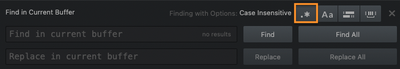

# Week 7: Data 1: By whom? For what?
October 9, 2023

## Plan for the day:

* [First half](#first-half): Let's discuss!
    - Warm-up writing
    - Terms, tensions, takeaways, confusions, questions, connections
    - Grok writing (around 10:30)
* Break (10 min)
* [Second half](#second-half): Let's practice!
    - Share and/or troubleshoot exercises from Montfort ch 7
    - Regular expressions with https://regexlearn.com/
    - EXT: studio time for projects

* [Homework for next time](#hw):

## First half: Discussion

### Warm-up writing
I'd like you to start by calling to mind the following terms from this week's readings and videos, which I've chosen among the many possible because I think they'll help us think *across* texts and contexts in a useful way:

* hierarchical
* classification
* encoding
* recursive
* abstraction

Take about 5 minutes to gather some thoughts about **where you've seen these ideas or words used _in more than one_ of this week's texts**: i.e. not just D'Ignazio and Klein's "[What Gets Counted Counts](https://ebookcentral.proquest.com/lib/pitt-ebooks/detail.action?docID=6120950)" or AmyJo Brown's advice on ["Building your own data set"](https://cmu-lib.github.io/dhlg/project-videos/brown/) – the two most popular texts for the forum – but maybe both of them, or maybe one and also Montfort's "[Standard Starting Points](https://mitpress.ublish.com/ebook/epah2e-preview/12629/C1)" or Beshero-Bondar's ["How to grow data forests with XML trees"](https://cmu-lib.github.io/dhlg/project-videos/besherobondar/).

**What does putting these different uses together help you notice? What does it lead you to wonder? Where might we go from there?**

### Let's talk!

If we get to grok-writing by around 10:15, that should give us about equal time to play with the concepts now and then to play with the methods in the second half.

And maybe we can take some collaborative notes at [bit.ly/dsam2023fall-notes](https://bit.ly/dsam2023fall-notes)?

Some possible moments to revisit, as needed:

<ol class="spaced"><li>AmyJo Brown: you can't capture it all:
<figure><iframe width="560" height="315" src="https://www.youtube.com/embed/5fUKTPAvYDM?si=XPD9jjMZamXCXwic&amp;clip=UgkxdxOVnNXP-CxCGXiUlFcpghrmy08VzwOH&amp;clipt=ELT2EBjY5BI" title="YouTube video player" frameborder="0" allow="accelerometer; autoplay; clipboard-write; encrypted-media; gyroscope; picture-in-picture; web-share" allowfullscreen></iframe></figure><!--Get familiar with the kinds of things you *can* record from your objects, then pose some questions you hope to answer by doing so – and use those questions to limit what kinds of data you track and clean.--></li>

<li>Catherine D'Ignazio and Lauren Klein: "the <em>paradox of exposure:</em> the double bind that places those who stand to significantly gain from being counted in the most danger from that same counting (or classifying) act" (<em>Data Feminism</em> 105). Or again: "[B]eing represented also means being made visible,a nd being made visible to the matrix of domination–which continously develops laws, practices, and cultural norms to police the gender binary–poses significant risks to the health and safety of minoritized groups" (110).
    <ul><li>Alex offered a very close-to-home lived experience with regard to census-taking.</li></ul>
</li>

<li>D'Ignazio and Klein's discussion of the Colored Conventions Project, pp. 118-119. Perhaps especially pertinent: "Acts of counting and classification, especially as they relate to minoritized groups, must always balance harms and benefits. When data are collected about real people and their lives, risks ranging from exposure to violence are always present. But when deliberately considered, and when consent is obtained, counting can contribute to efforts to increase valuable and desired visibility."</li>

<li>Nick Montfort: "Now, it seems that a clever and effective way to test our two programs would be to see if <code>to_f(to_c(25))</code> was (at least approximately) 25 and if <code>to_c(to_f(90))</code> is 90 and so on. We'd like to call one function on the other and vice versa [... but] if we had tried to print our result instead of returning it, we couldn't use this method of testing the programs. [...] we can't have nice things if we write our functions to <code>print()</code> (i.e. to visually display) values instead of using <code>return</code> so that other code can make use of the result" (102-103).</li>

</ol>

### Grok writing

    
Spend some time putting marks on a page to help you think through, and consolidate for yourself, what we discussed today. What do you want to remember? What are you left wondering?

After a few minutes, I'll ask everyone to share one thing, to which we'll all say, simply, "thank you."

<a href="week-03#an-explanation" class="smaller" title="We skipped this explanation in week 3, but it's there if you're curious">Why this terminology?</a>

## Break (10 minutes)
Assuming we left off at 10:30, let's aim to start up again at 10:40 or so. That should beat the elevator rush for 11am classes.

## Second half: Starter Programs

This is a chance to talk through anything that was hard in the chapter, which I suspect may include...

* navigating with the command line
* running scripts from .py files
* saving test examples at the ends of files
* error handling

But mostly, it's a chance to build up your confidence. So let's start by sharing what you *did* rather than what you *didn't* do!

Working in pairs, share your Exercises and Free Projects from Montfort chapter 7.

For example:
* 7-2, Conversion script
* 7-3, Classifier script
* 7-5, Factorial Mash-Up
* Free projects (pick one):
    - 7-1: Stochastic Texts again
    - 7-2: Modify starter programs
    - 7-3: Write your own starter program

Call me over if you have questions your partner can't help you answer, or if your partner did something really cool and you just want to share it!

### (N)EXT: Regular expressions

When you're both satisfied that you've begun to grok the chapter's lessons, first call me over and show me your free projects! I'm excited to see what you came up with.

After that, though, go ahead and start this tutorial I found that walks you through one common implementation of _regular expressions_, that super-powered search-and-replace tool for text that we talked about last week:

**[https://regexlearn.com/](https://regexlearn.com/)**

At each step, you'll have to write an expression to match the targets they give you, using the regex feature explained on that page (or, sometimes, a previous one).

If you want to practice matching things in your own example text, [https://regexr.com/](https://regexr.com/) has a nice playground that also lets you get more information about how the search is working. It's also a great way to do the character-by-character breakdown of someone else's regex expression, like Chloe was doing last week. (Sorry I didn't have this ready to share at the time, Chloe!)

NB: Pulsar has a built-in regex search as well: hit <ctrl/cmd>-F and click on the button with a period and asterisk:
<figure></figure>
You can also access this with a keyboard shortcut; on Mac, it's <code>⌥⌘/</code>.

## EXT: Project studio

If you've finished both of the hands-on activities above, go ahead and work on your own project. Don't forget to document how you use the time, especially if you're making decisions about how to classify or modify something you'll use as data.

## Homework for next time:
Upcoming DSAM-relevant events! Not required, but highly recommended:
* Xiqiao Wang, this Thursday at 9:30-10:45am, "[Multilingual writing in entanglement](https://calendar.pitt.edu/event/works_in_progress_xiqiao_wang)." Dr. Wang uses networks as both a metaphor and a method to map the connections between people and places, texts and techniques. This work-in-progress presentation is drawn from her book manuscript, currently under review. In 501CL.
* Antonio Byrd, "[Coding Black Functions for White Software Programs](https://calendar.pitt.edu/event/dr_antonio_byrd_coding_black_functions_for_white_software_programs)," Thursday, October 26, 5:00-6:30pm, 501CL. Dr. Byrd's talk is super-relevant to this week's topics: he'll be presenting findings from focus-group interviews and participant-observation in a coding "bootcamp," noting the ways that the curricula and assessment practices largely center white end-users, and proposing an alternative vision. This is part of his book-in-progress called _The Literacy Pivot: How Black Adults Learn Computer Programming in a Racist World_.

By Friday, please **read**...

* D’Ignazio, Catherine, and Lauren F. Klein. "5: Unicorns, Janitors, Ninjas, Wizards, and Rock Stars." _Data Feminism_. MIT Press, 2020. ProQuest Ebook Central, <a href="http://ebookcentral.proquest.com/lib/pitt-ebooks/detail.action?docID=6120950">http://ebookcentral.proquest.com/lib/pitt-ebooks/detail.action?docID=6120950</a>.
* Schöch, Christof. “Big? Smart? Clean? Messy? Data in the Humanities.” _Journal of Digital Humanities_, Nov. 2013, <a href="https://journalofdigitalhumanities.org/2-3/big-smart-clean-messy-data-in-the-humanities/">https://journalofdigitalhumanities.org/2-3/big-smart-clean-messy-data-in-the-humanities/</a>.
* Rawson, Katie, and Trevor Muñoz. “23: Against Cleaning.” _Debates in the Digital Humanities_ 2019, edited by Matthew K. Gold and Lauren F. Klein, <a href="https://dhdebates.gc.cuny.edu/read/untitled-f2acf72c-a469-49d8-be35-67f9ac1e3a60/section/07154de9-4903-428e-9c61-7a92a6f22e51#ch23>https://dhdebates.gc.cuny.edu/read/untitled-f2acf72c-a469-49d8-be35-67f9ac1e3a60/section/07154de9-4903-428e-9c61-7a92a6f22e51#ch23.</a> Accessed 18 Aug. 2023.

And **watch**:
* Gradek, Bob, and Liz Monk. "Dataset Summaries: Pivot Tables", 2022. vimeo.com, <a href="https://vimeo.com/703773939">https://vimeo.com/703773939</a>.

Finally, please **write**: as usual, you'll find a [discussion forum]({{site.repo_url}}/discussions) for your 100-ish-word responses (excitements, incitements, enticements), which I'll look at while I prepare next week's lesson plan. Pointing us to a particular place in one of the readings (or videos) will be the most helpful, I expect. And if you were able to get them up by Friday (and I know it's not always possible), that's always ideal.
